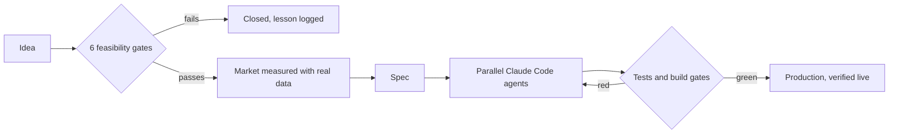

# Evgenii — I build with AI agents, and I don't trust them blindly

Solo builder in the US. I ship LLM apps and data pipelines by directing Claude Code agents,
then make the agents prove their work with sources, tests and build gates.

**Gate before build · Source or drop · Test before trust**

Open to early-career AI engineering and AI ops roles · remote, US

## How I work

## Open source

| Repo | Principle | What it is |
|---|---|---|
| [solo-ai-workshop](https://github.com/kabluk/solo-ai-workshop) | Gate before build | My operating system as a template: project registry, research that must end in a verdict, agent rules |
| [idea-gates](https://github.com/kabluk/idea-gates) | Gate before build | Claude Code skill: six feasibility gates before any market research |
| [llm-news-triage](https://github.com/kabluk/llm-news-triage) | Source or drop | Claude API pipeline where every claim cites its source or is dropped · 63 tests |
| [claude-code-kit](https://github.com/kabluk/claude-code-kit) | Test before trust | Subagents, commands, skills and hooks I reuse across 7+ repos |

## In production (closed source)

- **[CarrierTruth](https://carriertruth.com)**: 4.48M US trucking carriers from FMCSA open data. Daily snapshot-and-diff ETL on GitHub Actions + Cloudflare D1, 107K change events tracked.
- **[AccessAtlas](https://verscala.com)**: accessibility-auditor directory and site scanner. Headless Chromium + axe-core on Cloudflare, Claude Haiku explains each finding, PDF fix plans. 574 agencies, 794 tests.
- **[DetNav](https://detnav.com)**: multilingual public-information service, ~1,089 pages in 4 languages, Stripe and WebAuthn, CI checks for translation parity. ~400 tests.
- **[homeequitymath](https://homeequitymath.com)**: 19 home-equity calculators; lender rates re-verified against source pages and hidden when stale. 245 tests.
- **IV Index** (pre-launch): mobile IV therapy directory where every price carries a source and a date. 192 providers, 239 pages.

## Numbers I'm proud of

- **10** products and **5** live sites since April 2026, ~1,800 commits, ~1,700 automated tests
- **6+** ideas closed at the gate before a single line of code
- **63** tests on an open-source LLM pipeline where the model can only fail safely
- **1.4 s** sitemap response over 4.48M rows, down from HTTP 500

## Stack

Python · TypeScript · SQL · Claude API · Claude Code · Cloudflare Workers / D1 · GitHub Actions · pytest · Playwright

## Contact
 · zincroom@gmail.com · 
