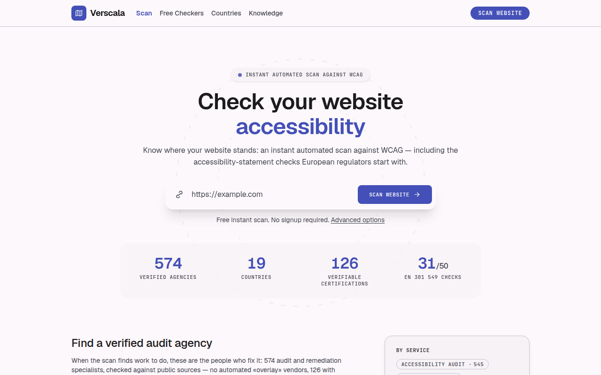
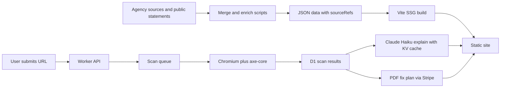

# AccessAtlas — a directory of accessibility auditors plus a free site scanner

**Live:** https://verscala.com · **Stack:** React + Vite SSG, Tailwind, Cloudflare Workers, D1, KV, Queues, Browser Rendering, Claude Haiku, Stripe · **Built:** Aug–Sep 2026 · **Status:** live, catalog and scanner in production

## The problem

The European Accessibility Act pushed many businesses selling in the EU to get an accessibility audit, but search results show only individual vendors, not a neutral place to compare them. Before calling anyone, a business owner also needs a first answer: how bad is my site, and what will fixing it involve?

## What I built

- A directory of 574 verified audit agencies across 19 countries. Every record carries at least one source link and a verification date; unknown fields stay empty instead of being guessed.
- A scanner: headless Chromium plus axe-core runs on Cloudflare Browser Rendering, crawls several pages of a site and scores the result.
- Plain-language explanations of each finding from Claude Haiku, cached in KV per rule and locale (`worker/lib/explain.js`). The prompt never sees the customer's HTML, so one site's wording cannot leak into the cache for everyone else.
- A paid PDF remediation plan through Stripe Checkout (verified end to end in test mode), printed by the same headless browser.
- An EN 301 549 coverage map generated from code: 31 of 50 chapter-9 criteria have an automated check, and the page states that "covered" does not mean "compliant".
- 10 free single-purpose checkers (contrast, readability, alt text, headings and others) and 27 editorial guides.

## Architecture

## Numbers

| Fact | Value |
|---|---|
| Agencies in the catalog | 574 |
| Countries | 19 |
| Automated tests | 794 (worker 522, src 210, scripts 62) |
| EN 301 549 web criteria with an automated check | 31 of 50 |
| Free checkers | 10 |
| Decisions logged | 187 |
| GitHub Actions workflows | 3 |

## The hardest problem

Scans hung in `running` forever. The first fix, a 120-second watchdog around the whole scan, did not stop it. The second closed stale scans when the report page polled them, which helped users but did not explain the cause.

The cause was in the platform docs: `ctx.waitUntil()` cancels background work 30 seconds after the response is sent. Every successful scan in production had taken 19–29 seconds; anything longer was killed silently, together with the watchdog that was supposed to record the failure.

The fix moved scanning into Cloudflare Queues, where a consumer can run for up to 15 minutes. Delivery is at-least-once, so the D1 row decides: a scan runs only if its row is still `running`. A missing queue binding returns an explicit 503 rather than a silent fallback to `waitUntil`. In a five-scan live run after deploy, one scan finished in about 32 seconds, past the old ceiling, and none of the five hung.

## How I worked with AI agents

- Work was planned as a dependency graph of 104 nodes. Each node had to finish with a decision record before it could be marked done.
- A Claude Code subagent wrote the queue migration. I re-ran the test suite myself and added my own canary: removing the idempotency check failed exactly the three tests that should catch it.
- A red result from a new gate is checked against the gate first: the first version of the mobile "answer above the fold" gate measured the wrong element.
- Deploys were confirmed by fetching the live site and running a 12-check smoke script, not by trusting a green CI log.

← [Back to profile](../README.md)
