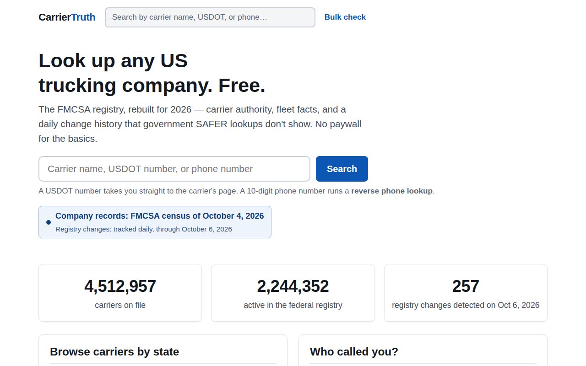
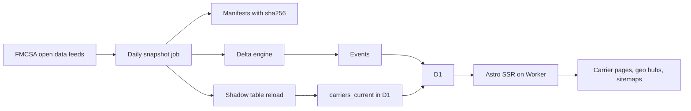

# CarrierTruth — every US trucking carrier, with a change history FMCSA does not keep

**Live:** https://carriertruth.com · **Stack:** Astro SSR, Cloudflare Workers, D1, GitHub Actions, Node ETL scripts · **Built:** Aug–Oct 2026 · **Status:** live, data refreshed on a schedule

## The problem

FMCSA publishes the current state of the US carrier registry, not its history. Brokers and shippers vetting a carrier care about exactly what disappears between snapshots: authority that flickers on and off, insurance gaps, sudden address or name changes. Those patterns only exist for someone who takes a snapshot every day and diffs it.

## What I built

- A snapshot-and-diff ETL on GitHub Actions over 10 FMCSA open-data feeds: each run stores a manifest with URL, row count and sha256 per file, so the origin of every snapshot can be proven.
- A delta engine that turns two snapshots into 12 event types (new authority, revocation, suspension, insurance lapse or filing, address, name, phone and fleet changes, status flips): 107,026 events loaded.
- A full catalog of 4,484,464 carriers in D1, active and inactive, rendered as Astro SSR pages on a Cloudflare Worker.
- A zero-downtime reload: shards load into a shadow table while the live one keeps serving, and a single swap transaction runs only after every shard succeeds.
- State and city hubs, a bulk CSV check, phone lookup, and a sitemap index of about 250 shards.
- Cost tests on hot paths such as search and migrations, written after measuring what each path actually costs in D1.

## Architecture

## Numbers

| Fact | Value |
|---|---|
| Carriers in the database | 4,484,464 |
| Change events tracked | 107,026 |
| FMCSA feeds snapshotted | 10 |
| GitHub Actions workflows | 8 |
| Test files in CI | 20 |
| Decisions logged | 91 |
| Geo sitemap response | 500 error → 200 in 1.4 s |

## The hardest problem

The geo sitemap, which lists about 24,700 state and city hub URLs, returned HTTP 500 on the first request. A retry succeeded only after about 62 seconds and was then cached for an hour. The shard computed its city list with a live `GROUP BY state, city HAVING COUNT(*) >= 5` over all 4.48 million rows of the carrier table, on every uncached request. Earlier work had removed full scans from carrier pages and hubs; this third consumer had been missed.

The fix reads from `city_stats`, a pre-aggregated table rebuilt inside the same transaction as the weekly reload, so the two can never disagree. The URL logic moved into its own module, and a test runs that real module against a fake database and counts reads of the carrier table. With pre-aggregation the count is zero. Two mutations prove the test works: removing the pre-aggregated branch fails it, and so does thresholding on all carriers instead of active ones. After deploy, the live geo sitemap returned 200 in 1.39 seconds.

## How I worked with AI agents

- The project memory lives in the repo: VISION, STATUS, HANDOFF, BACKLOG and a decision log of 91 entries. Each session starts from those files, not from chat history.
- Session hooks enforce the routine: the start hook loads project state, and the stop hook blocks ending a cycle that has commits but no lessons recorded.
- Agents wrote most scripts and tests. I required mutation checks for new gates, so a test counts only if breaking the code makes it fail.
- Production claims were checked against production: live HTTP responses, timings and workflow logs, not the agent's summary. When a document said a migration was applied and the database said otherwise, the database won and the fix was logged.

← [Back to profile](../README.md)
