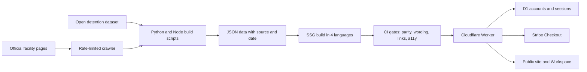

# DetNav — a multilingual guide for families of people held in US immigration detention

**Live:** https://detnav.com · **Stack:** React + vite-react-ssg, Tailwind, PWA, Cloudflare Workers, D1, Stripe, WebAuthn · **Built:** Apr–Oct 2026 · **Status:** live, paid Workspace accepting payments since Sep 25, 2026

## The problem

When someone is taken into US immigration detention, their family has to find out where the person is held, how to call, send money or visit, and what the court schedule means, often in a language other than English. The official information is spread across facility pages, court data and PDFs. DetNav puts it in one place as public information, not legal advice.

## What I built

- A static site of about 1,089 URLs in four languages (English, Spanish, Russian, Simplified Chinese): facility pages, court pages with bond statistics, state and city pages, and guides.
- A facility dataset built from public sources: 196 facilities from an open detention dataset, enriched by a rate-limited crawl of the official facility pages for phone, hours and visiting rules, each facility carrying its source URL and check date.
- A translation parity check in CI: each language file must match the English skeleton (keys, array lengths, links, placeholders), so a missing step in one language fails the build.
- A CI linter that blocks wording that reads like individual legal advice, with phrase lists in all four languages (no "you should", outcome predictions, "best option" or eligibility claims).
- A paid Workspace: Stripe Checkout, passwordless login by a one-time email code, optional passkeys (WebAuthn), server-side sessions in D1 and a two-device limit. The database stores the account and purchase, nothing about the detained person.
- An offline-capable PWA with a first-screen weight budget checked in CI.

## Architecture

## Numbers

| Fact | Value |
|---|---|
| URLs in sitemap | ~1,089 |
| Languages | 4, with structural parity check |
| Facilities in the directory | 196 |
| Tests | ~400 (406 test cases) |
| CI gates before deploy | typecheck, wording linter, parity, tests, links, page weight, URL freeze, axe-core |
| Decisions logged | 50 in the current log |

## The hardest problem

Knowing that production actually matched `main`. At one point the live site had been serving a build from a different repository for about three weeks; it was found by hand, by comparing the number of URLs in the live sitemap with the local build.

The first fix was `check-deploy`: it fetches the live sitemap, diffs it against the built one, and probes pages that exist only in the new build. A day later production served an old checklist while the check stayed green, because editing text inside a page does not change the URL list. The second fix hashes page content at build time into `/version.json`, and `check-deploy` compares the live hash with the local one. Deploy notes now record the live hash next to the local one.

A related gate came from the same week: an unfilled template placeholder reached production three times, each caught only by a manual grep. The build now fails on any unclosed placeholder.

## How I worked with AI agents

- I wrote the product rules and the build spec; agents implemented pages, scripts and tests against them, and every decision went into the log with its reason.
- Rules that must never break became CI gates, not review notes: legal-advice wording, translation parity, URL freeze, accessibility.
- I tested the payment flow myself on production with a real card: purchase, webhook, email code, login, refund, access closed.
- Translations by agents were treated as drafts. The Chinese version is built and live but kept out of search until a native speaker reviews it.

← [Back to profile](../README.md)
