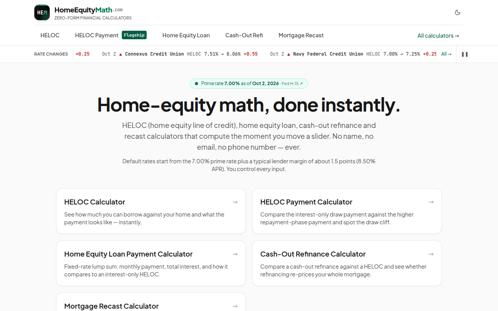
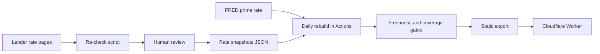

# homeequitymath — home-equity calculators with lender rates that are checked, dated, or hidden

**Live:** https://homeequitymath.com · **Stack:** Next.js static export, TypeScript, Tailwind, Cloudflare Workers, GitHub Actions, Vitest · **Built:** Aug–Oct 2026 · **Status:** live, rates re-verified on a schedule

## The problem

US homeowners comparing a HELOC, a home-equity loan or a cash-out refinance usually meet calculators that ask for a phone number first and rate tables sorted by who pays the site. The rates are often weeks old with no date shown. homeequitymath gives the math instantly, with no form, and shows only rates it can date to the lender's own page.

## What I built

- 19 calculators in two groups: borrowing against a home (HELOC, home-equity loan, cash-out refinance, recast, ARM, points, break-even and others) and project cost estimates (renovation, ADU, addition, basement, pool, solar loan).
- Two rate tables with 20 lender rows. Each row stores the source URL and the date it was observed.
- A freshness policy in code: rows older than 14 days are hidden, not shown with a warning. If coverage drops below target, the rate page returns to `noindex` and leaves the sitemap instead of sitting in search with an empty table.
- A neutral sort: by APR by default, with no field for affiliate status, so the sort cannot favour a payer.
- A re-verification script that reads every lender page, quotes the line it matched, and reports `ok`, `MOVED` or `NO DATA`. It never writes data; a person updates the rates.
- A daily rebuild that pulls the prime rate, plus a rate history page that shows every move with a link to the lender's page.

## Architecture

## Numbers

| Fact | Value |
|---|---|
| Calculators | 19 |
| Lender rate rows | 20 |
| Tests | 245 |
| GitHub Actions workflows | 4 |
| Stale-row threshold | 14 days, then hidden |
| Decisions logged | 13 |

## The hardest problem

The re-check script could confirm a rate that was wrong. On one run it reported a HELOC row as `ok` at 6.75%. During review, every row confirmed by a single bare number was re-read by hand. Four were real. In the fifth, the script had found "6.750%" in a fixed-rate table further down the same page, while the HELOC itself had moved to 7.00% when the prime rate rose.

The rule that came out of it: a bare number anywhere on a page is not evidence. The fix added `rate-anchors.json`, a phrase from the lender's own page that names the block the rate sits in. A bare figure counts as confirmed only when its anchor appears beside it; otherwise the result is `CHECK`, not `ok`. Anchors are never published; they are notes on how to re-read a page.

On the next run the anchored script confirmed 15 of 20 rows and flagged 5 as `MOVED`. All five were real changes, and all five were re-read and updated the same day.

## How I worked with AI agents

- The product started from a measured niche: keyword demand pulled from DataForSEO and written up before any code, then a written spec and an accepted prototype.
- Agents wrote calculators, scripts and tests. Every gate had to prove it could fail: snapshots were moved 20 days into the past in a real build to confirm the page left the index and the sitemap.
- The re-check script reports and I decide. Rate data changes only after a person reads the source.
- Lessons go into a learning log in the repo, including misses in my own process.

← [Back to profile](../README.md)
