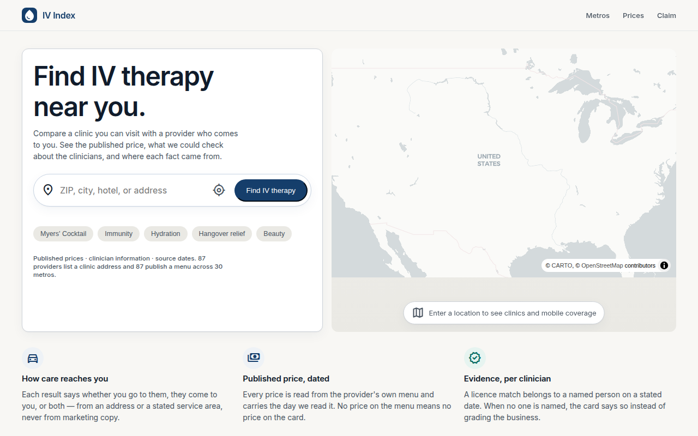
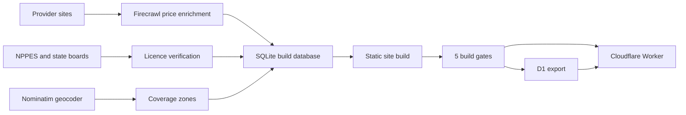

# IV Index — a mobile IV therapy directory where every price has a source and a date

**Live:** https://ivindex.com (pre-launch, `noindex`) · **Stack:** Node build from SQLite, static HTML and CSS, Cloudflare Workers, D1, MapLibre · **Built:** Aug–Oct 2026 · **Status:** pre-launch; site complete on the production domain, closed to search engines

## The problem

Mobile IV therapy providers come to your home, so they have no storefront and no map pin; what matters is whether their service area reaches your address and what a drip actually costs. Search results are filled with single-city operators and no aggregator. IV Index lets a person search by location, compare published prices, and see which providers have a clinician licence checked against a state registry.

## What I built

- A niche chosen from a 101-niche sweep scored on live DataForSEO data: demand, CPC, trend, resistance to AI answers and competitive gap.
- A catalog of 192 providers in 30 metro areas. Each price, coverage zone and licence result stores its source URL and date, and coverage is labelled as either stated by the provider or inferred.
- Coverage search: a place resolves to a point, and the results show providers whose zone reaches it. The map draws only geography we actually have.
- A licence pipeline: the federal NPI registry (NPPES) as an automatic first pass that finds leads, then a check against the state board for the badge. An NPI lead never becomes a badge by itself.
- A publication gate in SQL: a metro page goes live only with at least three providers with coverage and at least one sourced price.
- Five build gates, including a medical-claims gate that fails the build if any page or JSON-LD says a treatment cures, treats or prevents something.

## Architecture

## Numbers

| Fact | Value |
|---|---|
| Providers | 192 |
| Metro areas | 30 |
| Pages in sitemap | 238, all returning 200 |
| Tests | 46 |
| Build gates | 5: medical claims, head and canonical, locator, legal pages, evidence |
| Niches compared before choosing | 101 |
| Decisions logged | 29 |

## The hardest problem

An independent QA pass found a provider from another state published in the Oklahoma City metro with a coverage zone marked `provider_stated`: a guess displayed as the provider's own words, the worst form of the error the product exists to prevent.

The cause was the geocode cache. Its key was what the provider wrote, such as a city name with a wrong state code, while the value was whatever the geocoder returned. The geocoder ignores an implausible state when the city name matches confidently, so a mistyped entry resolved to a place inside Oklahoma City.

The fix was a shared module every consumer of the cache must use: a result whose state contradicts the stated one is dropped, and canonical spelling comes from the geocoder's display name, which also merged duplicate city spellings. Measured effect: 11 of 570 cached entries dropped, all with the same fake state code, no false positives. Stated zones went from 125 to 124 and inferred from 113 to 114; the provider stayed listed, now with an honest inferred zone.

## How I worked with AI agents

- The decision log keeps the reasoning, including corrections, such as a first publication gate that would have kept the site from ever launching.
- Product rules became build gates: a rule without a gate comes back.
- Agents ran the bulk work: crawling, NPPES lookups and data import. Licence badges come only from a state-board match with a stored source and date.
- Before launch, production was checked by its live responses, not by the docs: all 238 URLs, internal links, robots headers and the legal pages.

← [Back to profile](../README.md)
